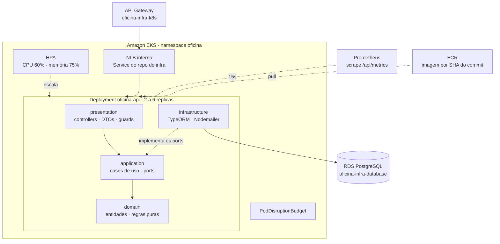

# oficina-api

**Aplicação principal** do Sistema Integrado de Atendimento e Execução de Serviços — Tech Challenge SOAT, Fase 3.

Back-end de uma oficina mecânica: gestão de ordens de serviço, clientes, veículos, serviços e peças, em **Clean Architecture**, executando em **Amazon EKS** com escalabilidade automática.

## Tecnologias

- **NestJS 11** + **TypeScript** (strict)
- **PostgreSQL 16** (Amazon RDS) + **TypeORM**
- **REST** com **Swagger** em `/docs`
- **prom-client** para métricas · log estruturado em JSON com correlação
- **JWT** (`@nestjs/jwt` + Passport)
- **Jest** — 76 testes
- **Docker** · **Kubernetes** (EKS) · **GitHub Actions** · **ECR**

## Arquitetura



O **Service** que expõe estes pods pertence ao repositório `oficina-infra-k8s`, porque é ele quem provisiona o Network Load Balancer consumido pelo API Gateway. O acoplamento entre os dois se dá apenas pelo label `app: oficina-api`, então a ordem de deploy é indiferente.

## Estrutura

Quatro camadas por bounded context, seis contextos:

```
src/
├── modules/
│   ├── auth/             autenticação administrativa (usuário e senha)
│   ├── clientes/
│   ├── veiculos/
│   ├── servicos/
│   ├── pecas/            controle de estoque
│   └── ordens-servico/
│       ├── domain/            OrdemServico, StatusOS, ItemOS, repository (interface)
│       ├── application/       casos de uso, NotificacaoPort
│       ├── infrastructure/    TypeORM repository, adapter de e-mail
│       └── presentation/      controllers, DTOs, presenter
└── shared/
    ├── database/         seed e data-source
    ├── filters/          exception filter
    ├── health/           GET /api/health para as probes
    ├── observabilidade/  métricas, logger JSON, correlação
    └── validators/       CPF/CNPJ e placa
```

O **domínio não conhece framework**: as entidades não importam NestJS nem TypeORM. Ver [ADR-005](docs/adr/005-clean-architecture.md).

## Fluxo da ordem de serviço

```
RECEBIDA → EM_DIAGNOSTICO → AGUARDANDO_APROVACAO → EM_EXECUCAO → FINALIZADA → ENTREGUE
                                     └─ recusa via webhook → CANCELADA
```

A cada transição o cliente é notificado por e-mail e a métrica de transições é incrementada. A aprovação dá baixa automática no estoque das peças, na mesma transação.

`GET /api/ordens-servico` ordena por **Em Execução > Aguardando Aprovação > Diagnóstico > Recebida**, mais antigas primeiro, ocultando finalizadas, entregues e canceladas.

## APIs

| Método | Rota | Proteção |
| --- | --- | --- |
| `POST` | `/auth` | Pública — emissão de token por CPF (Lambda) |
| `GET` | `/api/health` | Pública — probes e smoke test |
| `GET` | `/api/metrics` | Interna — alvo do Prometheus |
| `GET` | `/api/publico/ordens-servico/{numero}/status` | Pública |
| `POST` | `/api/publico/ordens-servico/{numero}/orcamento` | Pública — webhook de aprovação |
| `*` | `/api/**` | **Protegida pelo authorizer do API Gateway** |

Documentação executável no **Swagger**: `/docs`. Collection do **Postman** em [`postman/`](postman), com o fluxo encadeado — rode `Auth → Login` e o token e os IDs são capturados automaticamente.

## Observabilidade

### Métricas

Expostas em `/api/metrics`, raspadas a cada 15 segundos pelo Prometheus.

| Métrica | Alimenta |
| --- | --- |
| `http_requests_total` | Throughput e taxa de erro 5xx |
| `http_request_duration_seconds` | Latência p50 e p95 por rota |
| `oficina_ordens_servico_criadas_total` | Volume diário de OS |
| `oficina_ordens_servico_por_status` | Distribuição por status |
| `oficina_ordem_servico_transicoes_total` | Fluxo entre status |
| `oficina_ordem_servico_duracao_status_segundos` | Tempo médio por status |
| `oficina_ordem_servico_erros_total` | Alerta crítico de falha no processamento |
| `oficina_integracao_falhas_total` | Erros nas integrações |

### Logs

JSON estruturado, com o `correlationId` propagado desde o API Gateway:

```json
{
  "timestamp": "2026-09-15T22:37:13.761Z",
  "nivel": "info",
  "servico": "oficina-api",
  "contexto": "OrdensServicoService",
  "correlationId": "req-abc123",
  "mensagem": "OS 42 movida para EM_EXECUCAO"
}
```

Os dashboards e alertas que consomem tudo isso vivem em [`oficina-infra-k8s`](https://github.com/fdacmatheus/oficina-infra-k8s).

## Execução local

```bash
cp .env.example .env
docker compose up --build
```

- API: http://localhost:3000/api
- Swagger: http://localhost:3000/docs
- Métricas: http://localhost:3000/api/metrics
- MailHog: http://localhost:8025

Sem Docker: `pnpm install && pnpm start:dev` (requer PostgreSQL local).

## Deploy em Kubernetes

Pré-requisitos: os repositórios `oficina-infra-database` e `oficina-infra-k8s` **já aplicados**.

```bash
aws eks update-kubeconfig --name oficina-eks --region us-east-1

# o pipeline substitui o placeholder pela imagem do commit
sed -i "s|IMAGEM_PLACEHOLDER|<conta>.dkr.ecr.us-east-1.amazonaws.com/oficina-api:<sha>|" k8s/api-deployment.yaml
kubectl apply -f k8s/ -n oficina

kubectl -n oficina rollout status deployment/oficina-api
```

### Testar a escalabilidade

```bash
kubectl -n oficina get hpa -w

# em outro terminal
hey -z 3m -c 80 "$API_GATEWAY_URL/api/health"
```

Acompanhe o painel **Escalabilidade — réplicas vs. CPU** no Grafana.

## Scripts

| Comando | Descrição |
| --- | --- |
| `pnpm start:dev` | API em modo watch |
| `pnpm build` | Compila para `dist/` |
| `pnpm test` | 76 testes unitários |
| `pnpm test:cov` | Cobertura |
| `pnpm lint` | ESLint com auto-fix |
| `pnpm seed` | Popula o banco com dados de exemplo |
| `pnpm migration:generate` | Gera migration a partir das entities |
| `pnpm migration:run` | Aplica migrations |

## Seed

Roda no startup por padrão (`AUTO_SEED=true`, idempotente). Cria **admin** (`admin` / `admin123`), 2 clientes (PF + PJ), 3 veículos, 4 serviços, 4 peças com estoque e 1 OS em `AGUARDANDO_APROVACAO`.

> O CPF do cliente PF é o que se usa em `POST /auth` para demonstrar a autenticação serverless.

## Documentação da arquitetura

Em [`docs/`](docs):

- [Diagrama de Componentes e de Sequência](docs/ARQUITETURA.md)
- [Modelagem de Dados e justificativa do banco](docs/MODELAGEM.md)
- [ADRs](docs/README.md#decisões) — decisões arquiteturais permanentes
- [RFCs](docs/README.md#decisões) — propostas técnicas com alternativas avaliadas

## CI/CD

[`.github/workflows/ci-cd.yml`](.github/workflows/ci-cd.yml)

| Gatilho | Ação |
| --- | --- |
| Pull Request | ESLint + 76 testes com cobertura + build + validação dos manifestos |
| Push em `homolog` | Imagem no ECR + deploy em homologação |
| Push em `main` | Imagem no ECR + deploy em produção + smoke test |

A imagem é tagueada pelo **SHA do commit**, garantindo que o rollout aponte para um artefato imutável em vez de uma tag móvel. O smoke test valida `/api/health` e confirma que `/api/metrics` expõe as métricas de negócio — uma regressão na instrumentação quebraria os dashboards silenciosamente sem essa verificação.

**Branch `main` protegida:** sem commits diretos, merge apenas por Pull Request.

**Secrets necessários**: `AWS_ACCESS_KEY_ID`, `AWS_SECRET_ACCESS_KEY`, `AWS_SESSION_TOKEN`.

## Variáveis de ambiente

Veja `.env.example`. Em Kubernetes, `k8s/configmap.yaml` traz a configuração não sensível; as credenciais do banco vêm do Secret `oficina-db-credentials`, materializado a partir do Secrets Manager pelo repositório de infraestrutura.

## Repositórios relacionados

| Repositório | Papel |
| --- | --- |
| [`oficina-infra-k8s`](https://github.com/fdacmatheus/oficina-infra-k8s) | Cluster EKS, API Gateway e observabilidade |
| [`oficina-infra-database`](https://github.com/fdacmatheus/oficina-infra-database) | RDS PostgreSQL gerenciado |
| [`oficina-lambda-auth`](https://github.com/fdacmatheus/oficina-lambda-auth) | Function serverless de autenticação por CPF |

### Ordem de aplicação

```
oficina-infra-database  →  oficina-lambda-auth  →  oficina-infra-k8s  →  oficina-api
```
