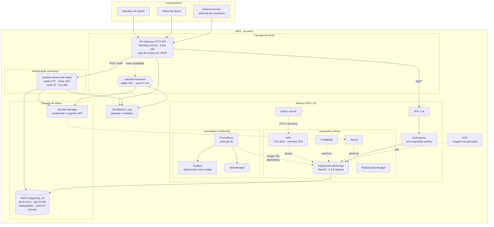
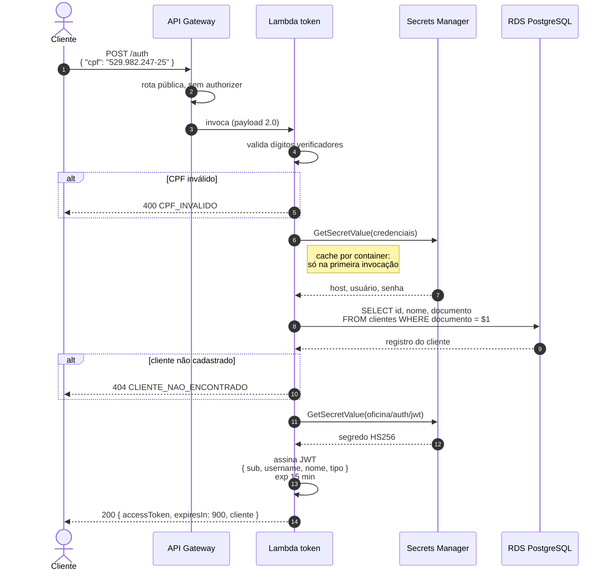
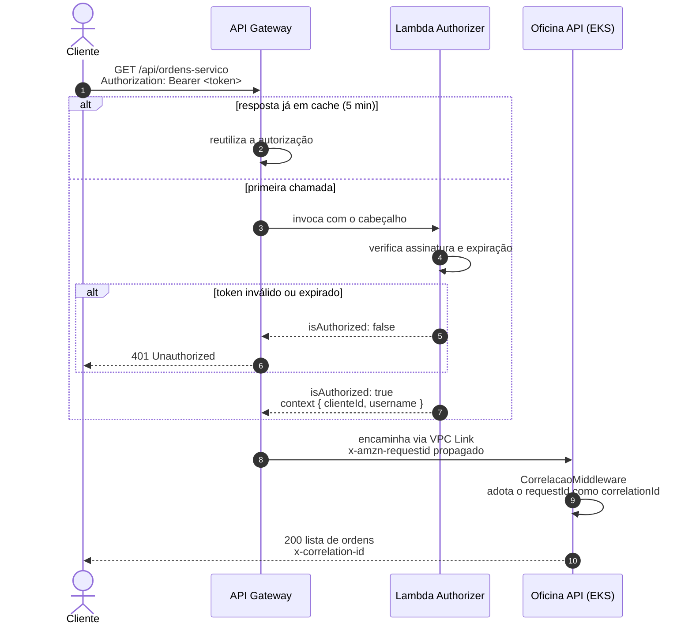
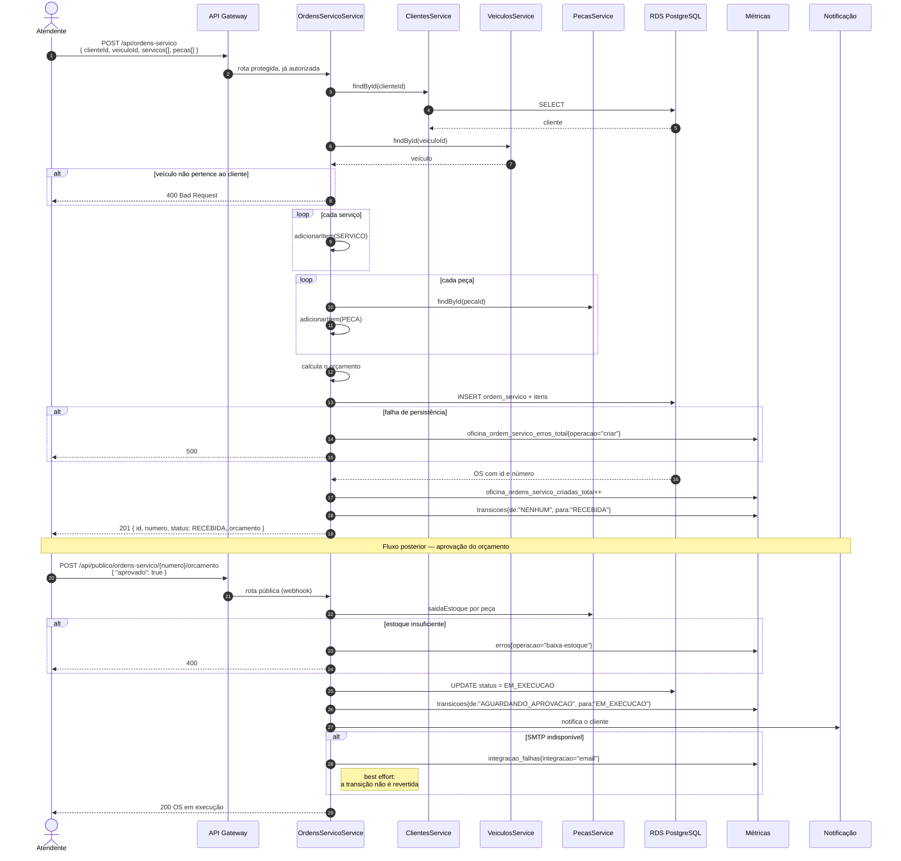
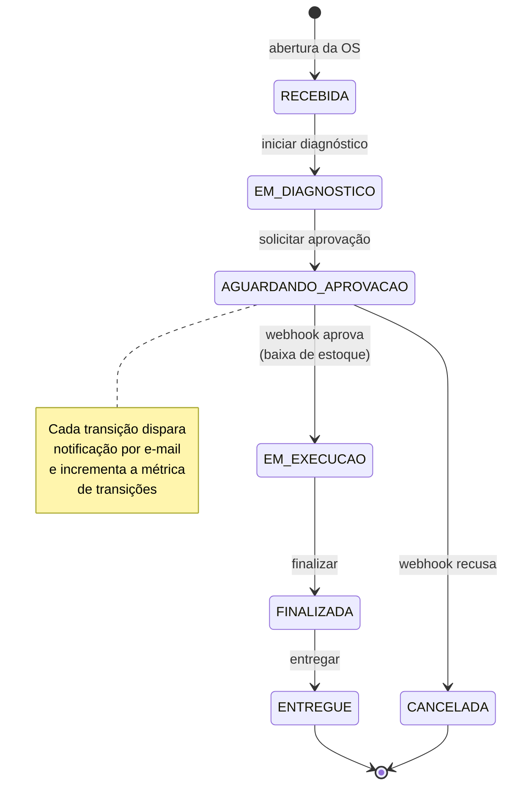
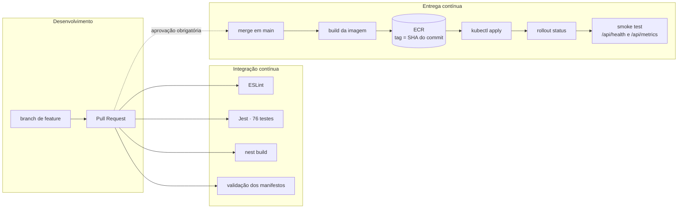

# Arquitetura

## Diagrama de Componentes

Visão de nuvem completa: entrada, computação, dados e monitoramento.

### Responsabilidade de cada repositório

| Componente | Repositório |
| --- | --- |
| API Gateway, VPC Link, EKS, NLB, Prometheus, Grafana, Alertmanager | `oficina-infra-k8s` |
| Lambda de token, Lambda authorizer, segredo JWT | `oficina-lambda-auth` |
| RDS PostgreSQL, Secrets Manager das credenciais | `oficina-infra-database` |
| Deployment, HPA, PodDisruptionBudget, ConfigMap, imagem | `oficina-api` |

---

## Diagramas de Sequência

### Autenticação por CPF

### Consumo de rota protegida

### Abertura de ordem de serviço

---

## Fluxo de estados da ordem de serviço

A listagem de `GET /api/ordens-servico` ordena por **Em Execução > Aguardando Aprovação > Diagnóstico > Recebida**, mais antigas primeiro, e oculta `FINALIZADA`, `ENTREGUE` e `CANCELADA`.

---

## Fluxo de CI/CD

A branch `main` é protegida: sem commits diretos, merge apenas por Pull Request. A branch `homolog` faz o mesmo caminho para o ambiente de homologação.
