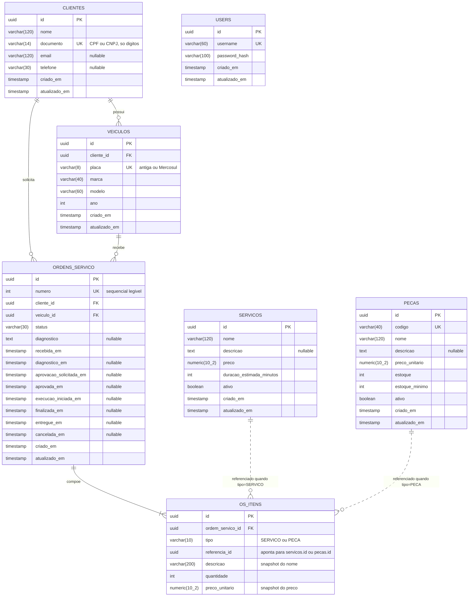

# Modelagem de Dados

## Diagrama ER



> `USERS` não se relaciona com as demais tabelas: guarda os operadores administrativos da oficina, autenticados por usuário e senha. Os **clientes** se autenticam por CPF pela function serverless e não têm registro nessa tabela.

## Justificativa da escolha do banco

### Por que relacional

O domínio é **fortemente relacional e transacional**:

- Uma ordem de serviço só é válida se o veículo pertencer ao cliente informado — uma invariante entre três tabelas.
- A aprovação do orçamento dá baixa no estoque de **todas** as peças da OS. Ou todas baixam, ou nenhuma: é uma transação ACID, não uma operação eventualmente consistente.
- As consultas do negócio são agregações e junções: volume diário de OS, tempo médio por status, ordens priorizadas por situação.

Um banco de documentos exigiria duplicar dados de cliente e veículo dentro de cada OS e implementar as invariantes em código de aplicação, sem garantia do banco. Nada no domínio justifica esse custo.

### Por que PostgreSQL

| Critério | Peso na decisão |
| --- | --- |
| `numeric(10,2)` exato | Valores monetários não toleram ponto flutuante; o tipo `NUMERIC` do PostgreSQL é decimal exato |
| `uuid` nativo | Chaves geradas pela aplicação, sem round-trip ao banco para obter o id |
| Nível de isolamento | A baixa de estoque concorrente depende de `SELECT ... FOR UPDATE`, com semântica previsível |
| Ecossistema TypeORM | Suporte maduro, migrations confiáveis |
| Custo no laboratório | `db.t3.micro` está no free tier — ~US$ 0,017/h |

MySQL atenderia tecnicamente. PostgreSQL foi escolhido pela precisão do `NUMERIC`, pelo tipo `uuid` de primeira classe e pela continuidade com o que já rodava nas Fases 1 e 2 — trocar de engine agora introduziria risco sem ganho.

Ver [RFC-002](rfc/002-escolha-do-banco-de-dados.md) para a avaliação completa das alternativas.

## Decisões de modelagem

### Snapshot de preço e descrição em `os_itens`

`os_itens` guarda `descricao` e `preco_unitario` **copiados** no momento da inclusão, em vez de apenas referenciar `servicos` ou `pecas`.

Isso é deliberado. Uma OS é um **documento fiscal**: se a oficina reajustar o preço de uma peça amanhã, o orçamento aprovado pelo cliente ontem não pode mudar de valor. A duplicação preserva a integridade histórica, que é mais importante aqui do que a normalização.

### `referencia_id` polimórfico

`os_itens.referencia_id` aponta para `servicos.id` **ou** `pecas.id`, discriminado por `tipo`. Não há chave estrangeira declarada.

A alternativa seria duas colunas nulas (`servico_id`, `peca_id`) com uma constraint `CHECK` garantindo exatamente uma preenchida. Isso daria integridade referencial real, ao custo de uma tabela mais larga e de consultas com `COALESCE`. Como o snapshot de preço e descrição já torna o item autossuficiente para leitura, a referência serve apenas para rastreabilidade, e a coluna polimórfica foi considerada suficiente.

**Consequência assumida:** excluir um serviço ou peça não é bloqueado pelo banco. Por isso `servicos` e `pecas` usam **exclusão lógica** (`ativo = false`) em vez de `DELETE`.

### Timestamps por transição

Em vez de uma tabela de histórico, cada transição tem sua própria coluna: `diagnostico_em`, `aprovada_em`, `finalizada_em` e assim por diante.

O fluxo da OS é **linear e finito** — sete estados, sem ciclos. Uma tabela de histórico seria mais flexível, mas o cálculo de tempo médio por status vira uma subtração direta entre colunas da mesma linha, sem junção:

```sql
SELECT AVG(finalizada_em - execucao_iniciada_em) AS tempo_medio_execucao
  FROM ordens_servico
 WHERE finalizada_em IS NOT NULL;
```

É essa consulta que alimenta o painel de tempo médio por status no Grafana.

### `numero` sequencial além do `id`

`ordens_servico` tem duas chaves: `id` (UUID) e `numero` (inteiro sequencial, único).

O UUID é a chave técnica. O `numero` é o que o cliente lê no balcão e digita para consultar sua OS em `GET /api/publico/ordens-servico/{numero}/status`. Expor um UUID de 36 caracteres nesse fluxo seria hostil ao usuário.

### `documento` sem máscara

`clientes.documento` guarda apenas dígitos (`52998224725`), nunca a versão formatada. A normalização acontece no construtor da entidade de domínio.

Isso garante que a busca por CPF da Lambda de autenticação encontre o registro independentemente de como o consumidor enviou o dado — com ou sem pontuação.

## Índices

| Tabela | Índice | Origem | Consulta atendida |
| --- | --- | --- | --- |
| `clientes` | `documento` | UNIQUE | Autenticação por CPF na Lambda |
| `veiculos` | `placa` | UNIQUE | Busca de veículo no atendimento |
| `veiculos` | `cliente_id` | FK | Veículos de um cliente |
| `pecas` | `codigo` | UNIQUE | Consulta de estoque |
| `ordens_servico` | `numero` | UNIQUE | Consulta pública de status |
| `ordens_servico` | `cliente_id`, `veiculo_id` | FK | Histórico do cliente e do veículo |
| `os_itens` | `ordem_servico_id` | FK | Itens de uma OS |

### Índice adicional recomendado

A listagem priorizada (`GET /api/ordens-servico`) filtra por status e ordena por data de recebimento. Com o crescimento da base, vale um índice composto:

```sql
CREATE INDEX idx_ordens_servico_status_recebida
    ON ordens_servico (status, recebida_em)
 WHERE status NOT IN ('FINALIZADA', 'ENTREGUE', 'CANCELADA');
```

O índice parcial cobre exatamente as ordens visíveis na listagem, que são a minoria das linhas em uma base madura — mantendo o índice pequeno e o plano de execução eficiente.

## Migrations

O schema é versionado por migrations do TypeORM. `DB_SYNCHRONIZE` está **desligado** em produção (`k8s/configmap.yaml`): sincronização automática pode alterar ou apagar colunas sem revisão.

```bash
pnpm migration:generate -- src/shared/database/migrations/NomeDaMigration
pnpm migration:run
```
